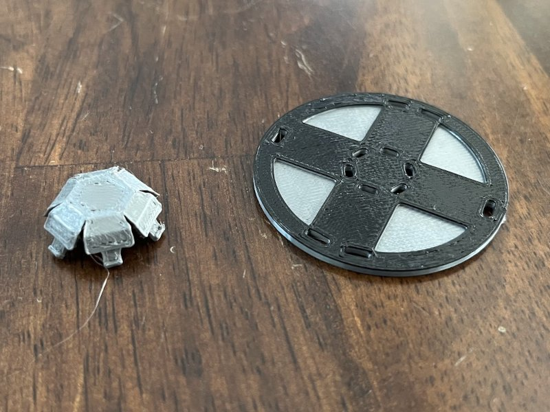
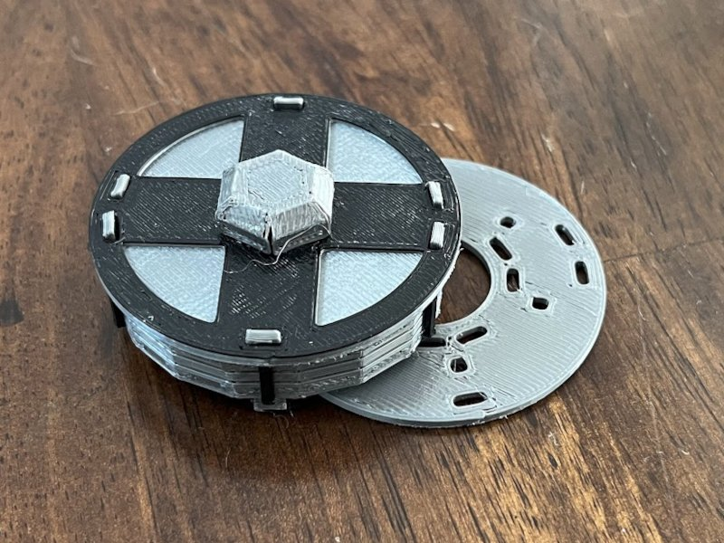
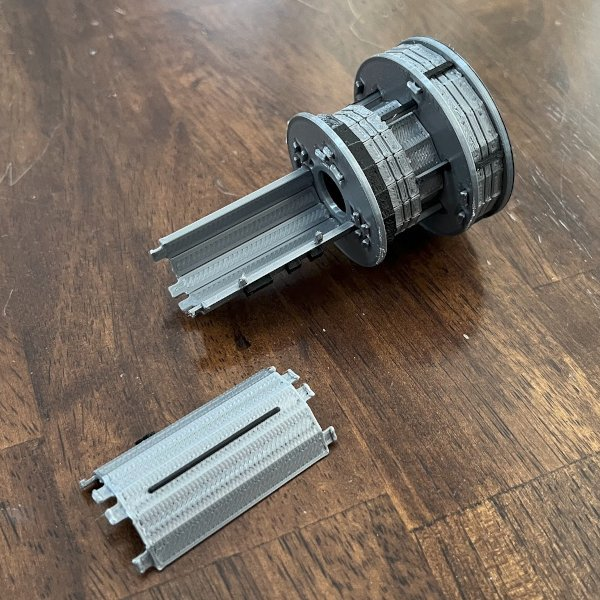

# White Cat (Theft of Fire) Kit Card Instructions

_Discs are numbered in order, from 1-4. All other parts (labelled A-F) will bend
into a cylindrical hull that connects the discs._

1. Begin with the nose (A). Bend all sides down and insert the tabs into the
   slots of disc (1). I've found that the easiest way to do this is to get all
   tabs near the correct position, then work your way around the perimeter securing
   one tab at a time.

   

2. Bend the each side of the cargo bay hull (B) into a half-circle and insert
   the tabs into disc (1). Again, I've found the tabs are easiest to insert by
   working around the perimeter one tab ad a time.

   

3. Push disc (2) against the bottom side of the cargo hull (B). Note the
   orientation of the tabs - pushing inward on the hull will make them go in
   more easily. Make sure they are lined correctly.

   

4. Bend the upper hull section (C) and insert the tabs into disc (2).

   

5. We're going to attach the upper outer hull (D) to disc (3) before attaching
   it to the rest of the assembly. Bend the outer hull (D) and insert the tabs
   disc (3).

   

6. We're going to attach the two parts we've built. Begin by lining up the
   parts, and insert the bars from the upper outer hull (D) into the holes in
   disc (2). Once all the bars are in, line up the tabs from the inner hull (C)
   with the slots in disc (3). Again, work around the perimeter of the disc, and
   apply inward pressure on the hull to fit the tabs into the slots.

   
   

7. Bend the bottom hull (E) and insert the tabs into disc (3).

   

8. Similar to step (5), we're going to attach the bottom hull ring (F) to disc
   (4) as a separate part. Do so now.

   

9. Similar to step (6), attach the two parts by lining up the tabs and pressing
   them together. **Congratulations**, your White Cat model is now complete!

   

